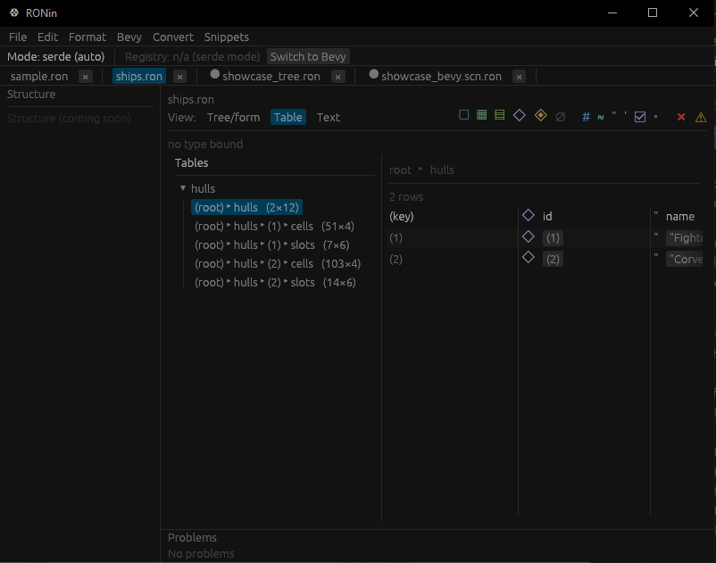
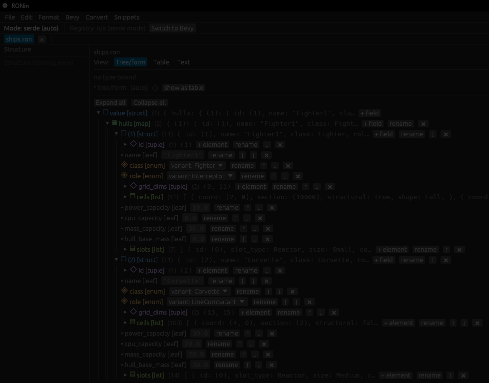
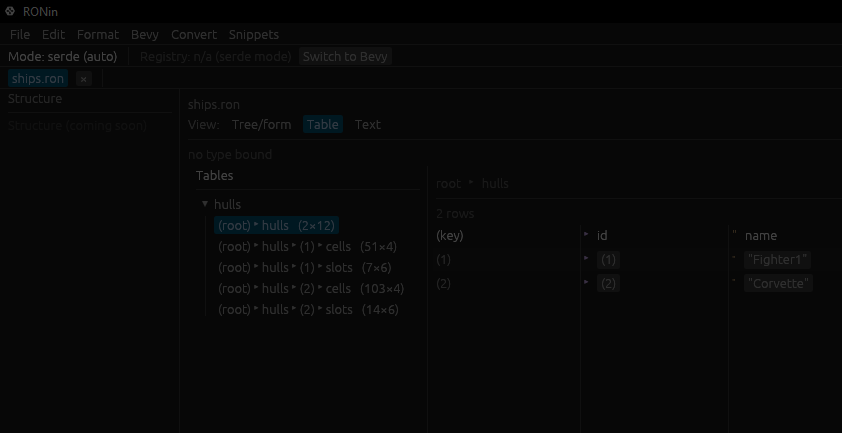
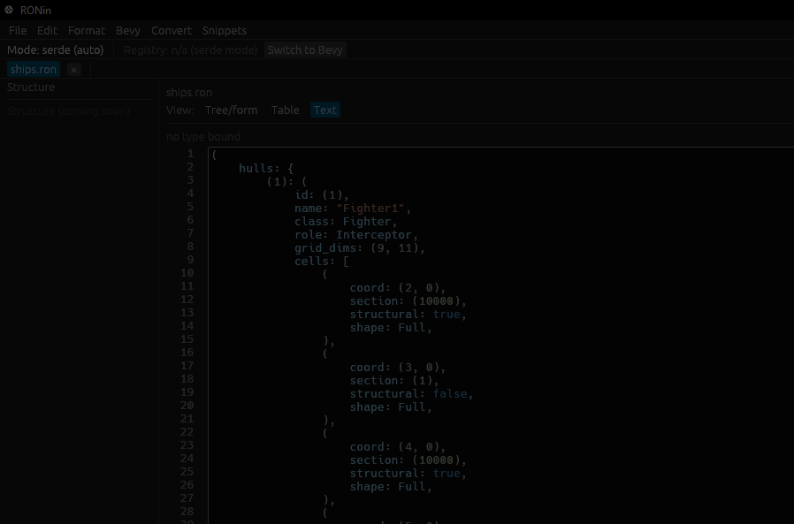

# RONin

**RONin** — a local-first desktop editor for **RON** (Rusty Object Notation):
lossless editing, type-aware validation, Bevy scene mode, and RON⇄JSON interop.

RONin preserves comments, formatting, key/field ordering, and struct names
through every edit, saves atomically with crash-recovery sidecars, and makes
**no network calls and collects no telemetry** by default.

The Cargo workspace:

| Crate | Role |
|-------|------|
| `ronin-core` | I/O-free, WASM-clean RON engine (lossless CST: parse / format / transform) |
| `ronin-types` | Static Rust type extraction → normalized type model |
| `ronin-validate` | Schema-optional, type-aware validation |
| `ronin-app` | The egui/eframe desktop editor (also installable via `cargo install` / `cargo binstall`) |

## Screenshots



| Tree/form | Table | Text |
|-----------|-------|------|
|  |  |  |

RONin projects one lossless document through **five views** — Tree/form, three
spreadsheet variants (outline / sections / grouped), and raw Text — with
**Excel-like cell editing** (range select, TSV copy/paste/fill, type-to-edit,
Enter/Tab to move, Delete to clear), type-aware validation, a Bevy scene mode, and
RON⇄JSON interop. See the [`ronin-app` README](src/ronin-app/README.md) for the
full feature tour.

## Install

### Prebuilt binary (recommended)

Download the tarball for your OS from the
[latest GitHub Release](https://github.com/jsh562/RONin/releases), extract it,
and run the `ronin-app` binary. Binaries are provided for:

- `x86_64-pc-windows-msvc` (Windows)
- `x86_64-apple-darwin` (Intel macOS)
- `aarch64-apple-darwin` (Apple Silicon macOS)
- `x86_64-unknown-linux-gnu` (Linux)

Each release also ships `install.sh` (shell) and `install.ps1` (PowerShell)
installer scripts.

> **Binaries are unsigned** (no paid code signing yet — see
> [DDR-003](specs/dod.md)). They carry SHA-256 checksums and keyless build
> provenance instead. See **Verifying your download** below — it also covers the
> macOS Gatekeeper / Windows SmartScreen prompts you may see on an unsigned
> binary.

### From crates.io

```bash
# Prebuilt binary via cargo binstall (fetches the GitHub Release tarball):
cargo binstall ronin-app

# Or compile from source:
cargo install ronin-app
```

## Verifying your download

RONin binaries are **unsigned** but every release artifact carries a **SHA-256
checksum** (integrity) and a **keyless build-provenance attestation** (origin),
so you can verify a download without any paid signing (DDR-003). This section
also covers the unsigned-binary OS prompts.

Replace `<tarball>` with the file you downloaded, e.g.
`ronin-app-x86_64-unknown-linux-gnu.tar.gz`.

### 1. Verify the SHA-256 checksum (integrity)

Each tarball has a matching `.sha256` file on the Release. Compute the hash of
your download and confirm it equals the published value.

**Linux:**

```bash
sha256sum -c <tarball>.sha256
# or compare manually:
sha256sum <tarball>
```

**macOS:**

```bash
shasum -a 256 <tarball>
# compare the printed hash against the contents of <tarball>.sha256
```

**Windows (PowerShell):**

```powershell
(Get-FileHash -Algorithm SHA256 <tarball>).Hash.ToLower()
# compare against the contents of <tarball>.sha256
Get-Content <tarball>.sha256
```

If the hashes differ, **do not run the binary** — the download is corrupt or
tampered with; re-download from the official Release.

### 2. Verify build provenance (origin)

Each tarball carries a keyless Sigstore/SLSA build-provenance attestation proving
it was built by this repository's release workflow.

**With the GitHub CLI ([`gh`](https://cli.github.com)):**

```bash
gh attestation verify <tarball> --repo jsh562/RONin
```

A successful result confirms the artifact's origin (this repo's release
pipeline). No paid certificate is involved.

**With [`cosign`](https://github.com/sigstore/cosign)** (alternative): you can
verify the same Sigstore attestation bundle with `cosign verify-blob-attestation`
against the artifact and the bundle published with the release.

### 3. Resolve the unsigned-binary prompt

Because the binaries are unsigned, your OS may warn on first launch. This is
expected (DDR-003) and does **not** indicate a bad download once steps 1–2 pass.

**macOS — Gatekeeper:** macOS quarantines downloaded unsigned apps. Either:

- Right-click (or Control-click) the `ronin-app` binary → **Open**, then confirm
  **Open** in the dialog (this whitelists that specific binary); or
- Remove the quarantine attribute from the command line:

  ```bash
  xattr -d com.apple.quarantine ronin-app
  ```

**Windows — SmartScreen:** Windows may show "Windows protected your PC". Click
**More info**, then **Run anyway** to launch the unsigned binary.

Signed installers / notarization (which remove these prompts) are deferred to a
later phase (DDR-003).

## Documentation

- **Release process** — [`docs/runbooks/release.md`](docs/runbooks/release.md)
  (prepare → tag → verify → rollback, the release-readiness checklist, and the
  secrets/token model).
- **CI & supply chain** — [`docs/runbooks/`](docs/runbooks/)
  (`branch-protection.md`, `advisory-response.md`, `ci-local-repro.md`).

## License

Licensed under **MIT OR Apache-2.0**.
