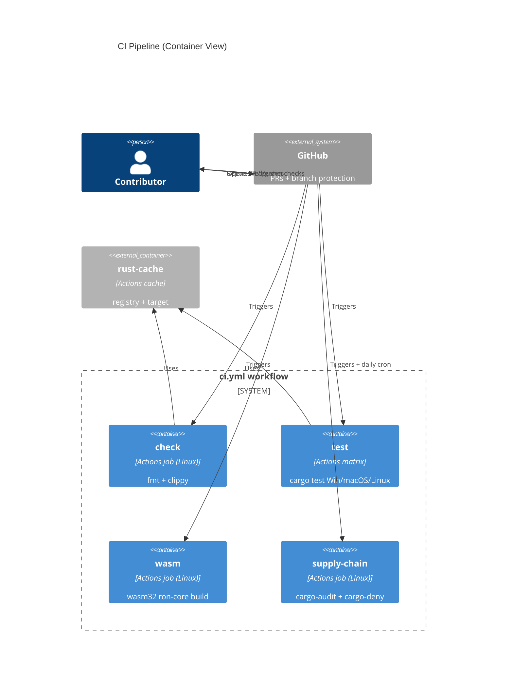

# Implementation Plan: CI Quality Gates

**Branch**: `00002-ci-quality-gates` | **Date**: 2026-06-11 | **Spec**: [spec.md](spec.md)

## Summary

**Goal**: A zero-cost GitHub Actions pipeline that gates every change with fmt/clippy/test (3-OS), a wasm32 `ron-core` build, and supply-chain scanning, plus operator runbooks.
**Approach**: One `ci.yml` with discrete named jobs (check, test-matrix, wasm, supply-chain) on `pull_request`/`push` + a daily schedule, using SHA-pinned third-party actions and rust-cache; merge-blocking via branch protection (runbook).
**Key Constraint**: Free-tier minutes + stable toolchain only; gate jobs require no secrets (fork-safe); the workspace-excluded `fuzz` crate must never build on the stable matrix.

## Technical Context

**Language/Version**: GitHub Actions workflow YAML; gates the Rust 2021 workspace (toolchain pinned via `rust-toolchain.toml`, stable ≥ 1.77)
**Primary Dependencies**: `actions/checkout`, `dtolnay/rust-toolchain`, `Swatinem/rust-cache`, `taiki-e/install-action` (prebuilt cargo-deny + cargo-audit), `actionlint` (workflow lint) — all third-party actions SHA-pinned
**Storage**: N/A — no persistence; GitHub Actions cache only
**Testing**: actionlint on the YAML; the pipeline itself validated by a real run (green on clean, red on injected failures); cargo-audit + cargo-deny are the security tier
**Target Platform**: GitHub-hosted runners — `ubuntu-latest`, `windows-latest`, `macos-latest`
**Project Type**: single (CI/ops for the existing workspace)
**Project Mode**: brownfield (adds `.github/workflows/` + `docs/runbooks/` to the E001 workspace)
**Performance Goals**: stay within free-tier minutes — caching + tests-only matrix + prebuilt tool installs
**Constraints**: zero budget (free tier); stable toolchain; no secrets in gate jobs; `Cargo.lock` committed + `--locked`; fuzz crate excluded
**Scale/Scope**: small OSS workspace; ~4 named jobs + 1 scheduled run

## Instructions Check

*GATE: Must pass before Phase 0 research. Re-check after Phase 1 design.* — **PASS** (re-checked post-design)

| Principle / Rule | Gate | Status |
|------------------|------|--------|
| V. Verified Quality | fmt + clippy -D warnings + 3-OS tests + wasm32 build enforced as gate jobs | PASS (OR-001..004) |
| II / ADR-0002 | wasm32 `ron-core` build job enforces WASM-clean invariant | PASS (OR-004) |
| Testing & Quality Policy | linting + security required; coverage advisory (no gate introduced) | PASS (OR-002/005; coverage excluded) |
| VI. Local-First & Private | CI tooling only; no product telemetry; no secrets in gates | PASS (OR-011) |
| Source Code Layout | workflows in `.github/workflows/`, runbooks in `docs/` (config/docs, correctly outside `/src`) | PASS |
| DDR-005 | mandatory wasm32 gate | PASS |

No violations — Complexity Tracking omitted.

## Architecture



## Architecture Decisions

Feature-local tradeoffs only. Project-wide decisions live in standalone ADRs (referenced by ID).

| ID | Decision | Options Considered | Chosen | Rationale |
|----|----------|--------------------|--------|-----------|
| AD-001 | Toolchain setup | dtolnay/rust-toolchain / manual rustup / actions-rs (deprecated) | `dtolnay/rust-toolchain` pinned to stable | maintained, fast, honors `rust-toolchain.toml` |
| AD-002 | Build caching | Swatinem/rust-cache / actions/cache manual / none | `Swatinem/rust-cache`, per-OS/target keys | purpose-built for Cargo registry + target |
| AD-003 | Supply-chain tool install | `cargo install` (compiles, slow) / `taiki-e/install-action` (prebuilt, pinned) / per-tool marketplace actions | `taiki-e/install-action` with pinned cargo-deny + cargo-audit, both run in one `supply-chain` job | fast prebuilt + version-pinned + single named check (spec Q6) |
| AD-004 | Scheduled-scan cadence | daily / weekly / 12h | **Daily** cron (00:00 UTC) | low advisory-detection latency at modest free-tier cost (spec deferred Q1 to plan) |
| AD-005 | Third-party action pinning | by major tag / by full commit SHA | Pin every third-party action by full commit SHA | supply-chain hardening + reproducibility (Dependabot bumps) |
| AD-006 | Job/OS matrix shape | full fmt+clippy+test on 3 OSes / tests×3 + others Linux-only | tests on {ubuntu,windows,macos}; fmt/clippy/wasm/supply-chain on ubuntu only | conserve free-tier minutes (spec Q4) |

No project-wide ADRs required (all choices are CI-config-local; the WASM-clean invariant is the existing ADR-0002).

## Data Model Summary

N/A — no persistent data.

## API Surface Summary

N/A — no API surface (CI configuration + runbooks only).

## Testing Strategy

| Tier | Tool | Scope | Mock Boundary | Install |
|------|------|-------|---------------|---------|
| Workflow lint | actionlint | Validate `ci.yml` syntax/expressions/job graph | — | `taiki-e/install-action actionlint` (CI) / local binary |
| Integration | GitHub Actions run | Whole pipeline green on a clean commit; red when fmt/clippy/test/wasm/advisory failures are injected | — | configured (runs on push/PR) |
| Security | cargo-audit + cargo-deny | dependency vulnerabilities + license/advisory/ban policy (deny.toml) | — | pinned via `taiki-e/install-action` |
| Coverage | N/A | advisory only — not gated (project policy) | — | N/A |

Local reproduction: `nektos/act` is optional for running the workflow locally; the runbook (RR-003) documents the raw `cargo` commands.

## Error Handling Strategy

N/A — this feature is CI configuration; failures surface as red GitHub checks (no application error model). The advisory-failure policy (hard-fail; dated waiver only) lives in OR-005 / RR-002.

## Integration Points

| Spec Reference | System/Service | Technical Approach | Contract |
|----------------|----------------|--------------------|----------|
| IP-001 | E001 Cargo workspace | jobs run `cargo` against the workspace (ron-core + stubs) | buildable workspace |
| IP-002 | cargo-deny | `cargo deny check` reads `deny.toml` at repo root | deny.toml (E001) |
| IP-003 | ADR-0002 WASM-clean | wasm job runs `cargo build -p ron-core --target wasm32-unknown-unknown` | SAD constraint |
| IP-004 | E011 Release | E011 gates releases on green CI | required checks |
| IP-005 | rust-toolchain.toml | toolchain action consumes the pinned stable version | toolchain pin (E001) |

## Risk Mitigation

| Risk (from spec) | Likelihood | Impact | Mitigation | Owner |
|-------------------|------------|--------|------------|-------|
| Free-tier minute limits as matrix grows | M | M | rust-cache + `fail-fast` + tests-only 3-OS matrix + prebuilt tool installs (AD-002/003/006) | CI |
| Cross-OS test flakiness (paths/line-endings) | L | M | deterministic tests + existing CRLF/BOM handling in ron-core; tests run identically per OS | CI |
| Advisory churn / scan noise | M | L | daily scheduled scan + RR-002 advisory-response runbook + curated deny.toml | maintainer |

## Requirement Coverage Map

| Req ID | Component(s) | File Path(s) | Notes |
|--------|--------------|--------------|-------|
| OR-001 | check job | .github/workflows/ci.yml | `cargo fmt --check` on Linux |
| OR-002 | check job | .github/workflows/ci.yml | `cargo clippy --workspace --all-targets -- -D warnings` on Linux |
| OR-003 | test job | .github/workflows/ci.yml | `cargo test --workspace --locked` on {ubuntu,windows,macos} |
| OR-004 | wasm job | .github/workflows/ci.yml | `cargo build -p ron-core --target wasm32-unknown-unknown` |
| OR-005 | supply-chain job + schedule | .github/workflows/ci.yml | one job, pinned cargo-audit+cargo-deny, on PR/push + daily cron; hard-fail; dated-waiver only |
| OR-006 | all jobs | .github/workflows/ci.yml | Swatinem/rust-cache per OS/target |
| OR-007 | repo + job cmds | Cargo.lock, ci.yml | commit Cargo.lock; `--locked` in build/test |
| OR-008 | all jobs | rust-toolchain.toml, ci.yml | dtolnay/rust-toolchain honors the pin |
| OR-009 | job command scope | ci.yml, Cargo.toml | `--workspace` excludes the root-excluded fuzz crate; no wasm/nightly build of it |
| OR-010 | job names | ci.yml | discrete named jobs (check, test, wasm, supply-chain) selectable as required checks |
| OR-011 | triggers | ci.yml | `pull_request` trigger; no `secrets.*` referenced in gate jobs |
| OR-012 | permissions + pins | ci.yml, .github/dependabot.yml | top-level `permissions: contents: read` (least-privilege GITHUB_TOKEN); all third-party actions full-SHA pinned (AD-005); Dependabot `github-actions` bumps pins |
| RR-001 | runbook | docs/runbooks/branch-protection.md | which checks to mark required |
| RR-002 | runbook | docs/runbooks/advisory-response.md | triage/patch/dated-waiver |
| RR-003 | runbook | docs/runbooks/ci-local-repro.md | raw fmt/clippy/test/wasm commands |

## Project Structure

### Source Code

```text
+ .github/workflows/ci.yml          # all gate jobs + daily schedule
+ docs/runbooks/branch-protection.md
+ docs/runbooks/advisory-response.md
+ docs/runbooks/ci-local-repro.md
~ Cargo.lock                        # ensure committed (OR-007)
  deny.toml                         # reused (E001)
  rust-toolchain.toml               # reused (E001)
  Cargo.toml                        # reused; root [workspace].exclude already covers fuzz
```

**Brownfield Notes**
- **Patterns to reuse**: existing `deny.toml`, `rust-toolchain.toml`, and the `[workspace].exclude = ["src/ron-core/fuzz"]` entry from E001.
- **Tests to extend**: none — this feature adds CI config; the gated test suite is E001's.
- **Naming conventions**: lowercase job ids matching the required-check names; kebab-case runbook filenames.

## Implementation Hints

- **[HINT-001]** Constraint: Pin every third-party action by full commit SHA (AD-005); add Dependabot for `github-actions` to bump them.
- **[HINT-002]** Gotcha: Scope cargo commands with `--workspace`; the root `[workspace].exclude` keeps the `fuzz` crate (nightly-only) out of the stable matrix (OR-009).
- **[HINT-003]** Order: Ensure `Cargo.lock` is committed before CI uses `--locked` (OR-007), else CI fails on a missing lockfile.
- **[HINT-004]** Performance: Run fmt/clippy/wasm/supply-chain on `ubuntu-latest` only; reserve the 3-OS matrix for the test job (AD-006) to conserve free-tier minutes.
- **[HINT-005]** Gotcha: Use the `pull_request` trigger and reference no `secrets.*` in gate jobs so fork PRs are fully validated (OR-011); branch protection / required checks is a repo-admin step (RR-001), not workflow YAML.
