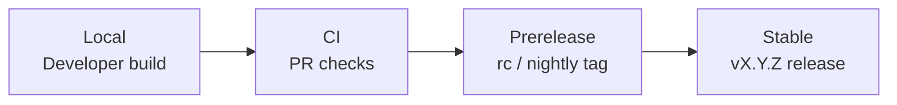
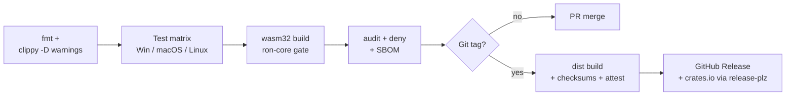
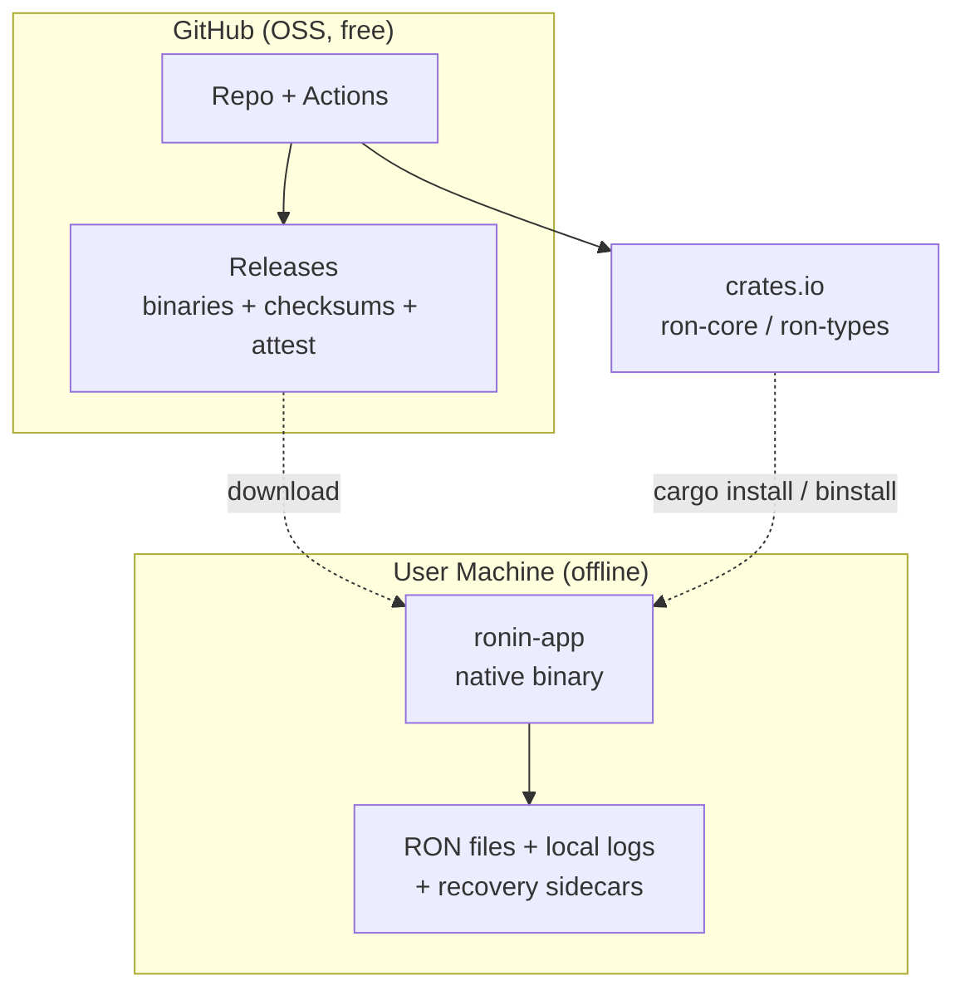

# Deployment & Operations Document: RONin

> Date: 2026-06-10 | Status: Draft

## Deployment Summary and Context

RONin is a local-first, offline desktop application plus reusable Rust library crates. There is no server, cloud backend, or hosted runtime to operate — "deployment" means software distribution (per-OS binaries and crates.io libraries) and "operations" means the release/CI process and client-side reliability. This document complements the architecture in [specs/sad.md](sad.md); it references rather than repeats those decisions (notably {SAD:ADR-0002} WASM-clean workspace and {SAD:ADR-0005} atomic save + crash recovery).

Operational priorities: ship trustworthy cross-platform releases at zero infrastructure cost, never collect user data, and guarantee that the client never loses or corrupts a user's file. Distribution follows a phased ladder, starting with GitHub Releases + crates.io.

## Environment Strategy

There is no server environment ladder. The "promotion path" is the build/release pipeline from a developer's machine to published artifacts.

| Environment | Purpose | Promotion Gate | Data Strategy | Parity with Release |
|-------------|---------|---------------|---------------|------------------|
| Local | Developer build and manual testing | None | Local RON files / test corpus | High (same crates) |
| CI | Per-PR validation across OSes | fmt + clippy + test matrix + wasm32 gate green | Test fixtures + corpus | High |
| Prerelease | Early-tester builds (`-rc`/`-nightly` tags) | CI green + maintainer tag | Real user files (opt-in testers) | Identical build, marked pre-release |
| Stable | General availability (`vX.Y.Z` tags) | Release-readiness checklist | Real user files | Baseline |

### Environment Flow

### Feature Flags and Progressive Rollout

- **Feature flags**: Cargo feature flags gate optional capability clusters (e.g. `bevy-mode`, `interop`), letting incomplete work merge without affecting default builds. No runtime flag service.
- **Rollout strategy**: Channel-based — opt-in prerelease (`-rc`/`-nightly`) for early feedback, then stable. Aligns with the PRD dogfooding → private beta → broader release gate.
- **Rollback trigger**: A release-blocking regression. Users pin/reinstall the prior version; a faulty crate publish is yanked from crates.io (yank hides it from new resolves without breaking existing lockfiles).

## Deployment Targets and Packaging

Phased distribution ladder (see DDR-001):

- **Phase 1 (now)**: `ronin-app` native binaries on GitHub Releases (tarballs + shell/PowerShell install scripts via `dist`); `ron-core` and `ron-types` libraries on crates.io (via `release-plz`); `cargo binstall` support from `dist` metadata.
- **Phase 2**: OS package managers — Homebrew tap (`dist`-managed), winget manifest, AUR PKGBUILD.
- **Phase 3 (deferred)**: Signed native installers (.msi/.dmg) and possible app-store channels.

- **Deployment model**: Cross-platform desktop binaries (Windows, macOS, Linux) + library crates; future WASM bundle for browser/VSCode-webview.
- **Build artifact**: Per-OS executable tarballs + install scripts; published library crates; SHA-256 checksums and a release manifest.
- **Container registry**: N/A (no containers).
- **Artifact tagging**: Semantic-version git tags; stable `vX.Y.Z`, prerelease `vX.Y.Z-rc.N` / `-nightly`.
- **Vulnerability scanning**: `cargo-audit` (RustSec) + `cargo-deny` in CI and on a schedule.
- **App store distribution**: Deferred to Phase 3.
- **Edge/CDN**: GitHub Releases' built-in CDN; no separate CDN.

## CI/CD Pipeline Design

### Pipeline Stages

- **Pipeline tooling**: GitHub Actions; `Swatinem/rust-cache` for `~/.cargo` + `target` caching keyed on toolchain + `Cargo.lock`.
- **Release automation**: `dist` generates the cross-platform release workflow and artifacts; `release-plz` opens a Release PR (conventional-commit version bumps, git-cliff changelog, `cargo-semver-checks`) and publishes the workspace to crates.io in dependency order on merge (see DDR-002).
- **WASM gate**: A dedicated job builds `ron-core` for `wasm32-unknown-unknown`; failure blocks merge, enforcing the {SAD:ADR-0002} WASM-clean invariant in CI (see DDR-005).
- **IaC approach**: None — no infrastructure to provision.
- **Deployment method**: Git-tag-triggered; channel determined by tag suffix.
- **Rollback automation**: crates.io yank + GitHub Release delete/supersede; no live traffic to switch.
- **Zero-downtime strategy**: N/A (client-side application).
- **Secrets in pipeline**: `CARGO_REGISTRY_TOKEN` (crates.io) and the Actions-provided `GITHUB_TOKEN`, stored as GitHub Actions secrets.

## Infrastructure and Hosting

- **Cloud provider**: None. Distribution rides GitHub (repo, Actions, Releases CDN) and crates.io.
- **Compute model**: GitHub-hosted Actions runners for build/release only; no persistent compute.
- **Networking**: N/A (no hosted endpoints). The application makes no network calls at runtime.
- **Storage infrastructure**: GitHub Releases and crates.io retain published artifacts; git retains tagged source + committed `Cargo.lock` for reproducible builds.
- **Cost estimation**: ~$0 on GitHub + crates.io free OSS tiers.
- **Budget constraints**: Zero-budget; the only future cost is optional Phase-3 signing certificates.

### Infrastructure Diagram

## Observability and Monitoring

### Logging
- **Approach**: Structured `tracing` with leveled spans; a non-blocking rolling file appender keeps writes off the egui frame path.
- **Aggregation**: None — logs stay local. No remote shipping.
- **Location & retention**: Logs in the OS data-local/cache directory (via the `directories` crate); daily rotation with a small retained file count. Settings live in the OS config directory; recovery sidecars per {SAD:ADR-0005}.

### Metrics
- **Application metrics**: No runtime telemetry. Quality is measured by tests/benchmarks in CI, not live metrics.
- **Infrastructure metrics**: N/A (no servers).
- **DORA metrics (adapted to a release-driven tool)**: deployment frequency → release cadence; lead time → commit-merged-to-released-tag; change-failure rate → fraction of releases needing a follow-up patch; MTTR → patch turnaround from a release-blocking report to the fix release. All derived from GitHub release + issue data.
- **Tooling**: GitHub releases/issues (labels) — no metrics backend.

### Tracing
- **Distributed tracing**: N/A (single local process).
- **Correlation**: In-process span context only.

### Alerting
- **Alert routing**: GitHub issue/CI failure notifications. No paging.
- **On-call schedule**: None (solo/OSS).
- **Escalation policy**: Maintainer triage on the next working session.

### SLI/SLO

Client-quality objectives validated in CI/tests rather than live probes.

| Target | SLI | Objective | Tolerance | Measurement |
|--------|-----|-----------|-----------|-------------|
| App | Crash-free sessions | ≥ 99% | — | Opt-in local logs + GitHub issue reports |
| App | Save integrity (no corruption) | 100% | zero | Fault-injection + property tests in CI |
| App | Large-file edit latency | within ~16 ms frame | occasional spikes | Corpus benchmarks in CI |
| Release | Release pipeline success | ≥ 95% green | — | CI release-workflow status |

## Reliability Engineering

- **Availability target**: N/A — RONin is a local desktop tool with no uptime SLA. Reliability means data integrity and recoverability.
- **RPO** (max work lost on crash): ≤ the autosave interval (target ≤ 30–60 s of unsaved edits before a recovery sidecar is written).
- **RTO** (time to recover): near-instant — on reopen, the recovery sidecar is detected and restore is offered ({SAD:ADR-0005}).

### Disaster Recovery
- **Backup strategy**: User data is the user's own files (RONin never relocates them). Releases are reproducible from tagged git source + committed `Cargo.lock`; crates.io and GitHub Releases retain published versions.
- **Failover mechanism**: N/A (no live service). Atomic temp-write+rename ensures the original file survives a failed/interrupted save.
- **DR testing cadence**: Fault-injection tests (disk full, kill mid-save, power-loss simulation) run in CI on every change.

### Capacity and Scaling
- **Scaling approach**: Client-side; the scaling axis is file size, not user count.
- **Scaling triggers**: N/A (no autoscaling). Large-file responsiveness is handled via incremental reparse + virtualized rendering (SAD).
- **Load testing**: Large-RON/Bevy corpus benchmarks in CI.

### Incident Management
- **Incident process**: GitHub issue → triage/label → reproduce → fix → patch release → changelog entry.
- **Runbook location**: `docs/` in-repo (release runbook + recovery troubleshooting).
- **Postmortem policy**: Blameless notes in release notes for significant regressions.

### Production Readiness Review (Release-Readiness Checklist)
- CI green on all OSes, including the wasm32 `ron-core` gate.
- Checksums + build-provenance attestations attached to the release.
- CHANGELOG updated; install/verify docs current.
- Built binary smoke-tested per OS.
- Atomic-save and crash-recovery tests passing.

## Security and Compliance in Operations

### Supply Chain Security
- **SBOM generation**: CycloneDX SBOM per release (`cargo-cyclonedx`); binaries built with `cargo-auditable` so dependency metadata is embedded.
- **Dependency scanning**: `cargo-audit` (RustSec) + `cargo-deny` (licenses/bans/advisories/duplicates) in CI and on a schedule; `cargo-vet` considered later.
- **Artifact signing**: Deferred (DDR-003). Interim: SHA-256 checksums + free keyless GitHub build-provenance attestations (`actions/attest-build-provenance`, Sigstore/SLSA), verifiable via `gh attestation verify` / `cosign`.

### Runtime Security
- **WAF / DDoS protection**: N/A (no network surface).
- **Intrusion detection**: N/A.
- **Network policies**: The application performs no network I/O at runtime; user-provided Rust source is parsed statically (syn), never executed.

### Secrets Management
- **Secrets store**: GitHub Actions secrets only (`CARGO_REGISTRY_TOKEN`, `GITHUB_TOKEN`). The application itself handles no secrets.
- **Rotation policy**: Rotate the crates.io token on suspicion/compromise; otherwise standard token hygiene.
- **Access pattern**: Injected into CI jobs as environment secrets; never committed.

### Compliance
- **Applicable frameworks**: None formally required. Privacy-by-design: local-first, no telemetry, no PII collected.
- **Audit logging**: Git history + signed release provenance attestations provide build/release auditability.
- **Infrastructure access control**: GitHub repository roles; release publishing restricted to maintainers.

## Operational Ownership and Processes

- **Production ownership model**: Solo/OSS "you build it, you run it"; no separate ops team.
- **On-call structure**: None; best-effort maintainer response.
- **Change management**: PR-based with required CI checks; `release-plz` Release PR for version/changelog.
- **Release approval**: Maintainer merges the Release PR and pushes the version tag.
- **Documentation expectations**: README (install + "verifying your download / unsigned binary" section), CHANGELOG, release runbook, recovery troubleshooting.

### Operational Maturity Roadmap

| Phase | Focus | Key Milestones |
|-------|-------|---------------|
| Crawl | Reliable manual-tag releases | CI matrix + wasm32 gate; `dist` + `release-plz`; checksums + attestations; crates.io publish |
| Walk | Lower-toil, wider reach | Prerelease channel; CycloneDX SBOM; scheduled `cargo-audit`; Homebrew/winget/AUR (Phase 2) |
| Run | Polished trust + breadth | Signed installers / notarization (Phase 3); `cargo-vet`; WASM/VSCode frontend release track |

## Cost Considerations

- **Estimated monthly cost**: ~$0 (GitHub + crates.io free OSS tiers; GitHub-hosted runners within free limits).
- **Major cost drivers**: Only future Phase-3 code-signing certificates (e.g. Apple Developer ~$99/yr; Windows OV/EV cert).
- **Cost optimization levers**: Build caching to stay within runner minutes; defer paid signing until adoption justifies it.
- **Cost monitoring**: Watch GitHub Actions usage; no billing alerts needed at current scale.

## Deployment Decisions

### DDR-001: Phased Distribution Ladder, GitHub-First

- **Status**: Accepted
- **Context**: The user wants the full distribution ladder eventually but a manageable start; solo/OSS, zero budget.
- **Decision**: Phase 1 = GitHub Releases (binaries) + crates.io (libraries) + `cargo binstall`; Phase 2 = Homebrew/winget/AUR; Phase 3 = signed installers/app stores.
- **Rationale**: Maximizes reach at zero cost immediately; defers per-channel maintenance and signing cost until warranted.
- **Alternatives Considered**: crates.io-only (excludes non-Rust users); all channels at once (too much upfront maintenance).
- **Tradeoffs**: Fast, free launch vs users self-installing unsigned binaries initially.
- **Consequences**: Phase 2/3 packaging tasks enter the roadmap, not the MVP.

### DDR-002: Release Automation via `dist` + `release-plz`

- **Status**: Accepted
- **Context**: Cross-platform binary builds + workspace crate publishing are error-prone by hand.
- **Decision**: Use `dist` for cross-platform binary builds/installers/checksums and `release-plz` for crates.io version bumps, changelog, and ordered workspace publishing.
- **Rationale**: Maintained, composable, low-toil; built for Cargo workspaces.
- **Alternatives Considered**: `cargo-release` (more manual); hand-rolled Actions matrices (fragile).
- **Tradeoffs**: Tool conventions to learn vs eliminated release toil.
- **Consequences**: `Cargo.lock` committed for reproducible builds/SBOMs.

### DDR-003: Defer Code Signing; Checksums + Keyless Provenance Now

- **Status**: Accepted
- **Context**: Platform signing has real cost; the user chose to defer it.
- **Decision**: Ship unsigned binaries with SHA-256 checksums and free keyless GitHub build-provenance attestations (Sigstore/SLSA); add platform signing/notarization in Phase 3.
- **Rationale**: Zero-cost verifiable provenance now; paid signing only when adoption justifies it.
- **Alternatives Considered**: Full notarization/Authenticode now (paid); checksums-only (weaker provenance).
- **Tradeoffs**: Verifiable origin but Gatekeeper/SmartScreen warnings remain until Phase 3.
- **Consequences**: README must document checksum/attestation verification and the Gatekeeper/SmartScreen workarounds.

### DDR-004: Stable + Prerelease Channels via Tag Suffix

- **Status**: Accepted
- **Context**: Early development needs fast feedback without destabilizing general users.
- **Decision**: `vX.Y.Z` = stable; `vX.Y.Z-rc.N` / `-nightly` = GitHub pre-release.
- **Rationale**: Simple, tooling-native channel separation supporting the PRD's dogfooding→beta→GA path.
- **Alternatives Considered**: Stable-only (slower feedback); rolling nightly primary (weaker stability).
- **Tradeoffs**: Slightly more release config vs an early-tester loop.
- **Consequences**: Testers opt in to prereleases explicitly.

### DDR-005: Mandatory wasm32 Build Gate in CI

- **Status**: Accepted
- **Context**: {SAD:ADR-0002} requires `ron-core` to stay WASM-clean for future frontends; drift is easy to introduce.
- **Decision**: A CI job builds `ron-core` for `wasm32-unknown-unknown`; failure blocks merge.
- **Rationale**: Turns the WASM-clean invariant into an enforced gate rather than a late surprise.
- **Alternatives Considered**: Periodic manual checks (drift risk).
- **Tradeoffs**: One extra CI job vs guaranteed portability.
- **Consequences**: Native-only deps must stay out of `ron-core` (in `ron-types`/`ronin-app`).

### DDR-006: Local-Only, Opt-In Observability

- **Status**: Accepted
- **Context**: Local-first, no-telemetry posture (PRD/SAD).
- **Decision**: `tracing` rolling local logs in OS-correct dirs; diagnostic/verbose capture is opt-in and never uploaded; health tracked via adapted DORA proxies from GitHub data.
- **Rationale**: Honors privacy-by-design while still giving the maintainer signal.
- **Alternatives Considered**: Default crash/telemetry upload (violates no-telemetry).
- **Tradeoffs**: Less automatic insight vs full user trust.
- **Consequences**: Users attach logs manually to issues when reporting.

## Risks, Assumptions, Constraints, and Open Questions

### Risks

- Unsigned binaries trigger Gatekeeper/SmartScreen warnings, deterring some users until Phase-3 signing.
- GitHub-hosted runner minutes/limits could constrain a large cross-platform matrix as the project grows.
- A bad crates.io publish can only be yanked, not deleted; ordering/versioning mistakes in workspace publishing are disruptive.
- Cross-compilation/packaging breakage per OS (especially macOS/Windows) can block releases.

### Assumptions

- The project is hosted on GitHub as OSS and publishes to crates.io (free tiers).
- Solo/OSS maintenance capacity; no on-call or paid infrastructure initially.
- `dist` + `release-plz` remain maintained and compatible with the workspace layout.

### Constraints

- Zero infrastructure budget initially; no paid signing in Phases 1–2.
- No telemetry or network calls at runtime; observability stays local and opt-in.
- `Cargo.lock` must be committed for reproducible release builds and SBOMs.
- All source under `/src` (per project layout); `ron-core` must remain WASM-clean.

### Open Questions

- Exact autosave interval (sets the RPO target).
- When (adoption threshold) to move to Phase 2 package managers and Phase 3 signing.
- Whether prerelease builds are nightly-scheduled or only `-rc` on demand.
- Log retention count/size defaults appropriate for a desktop tool.
