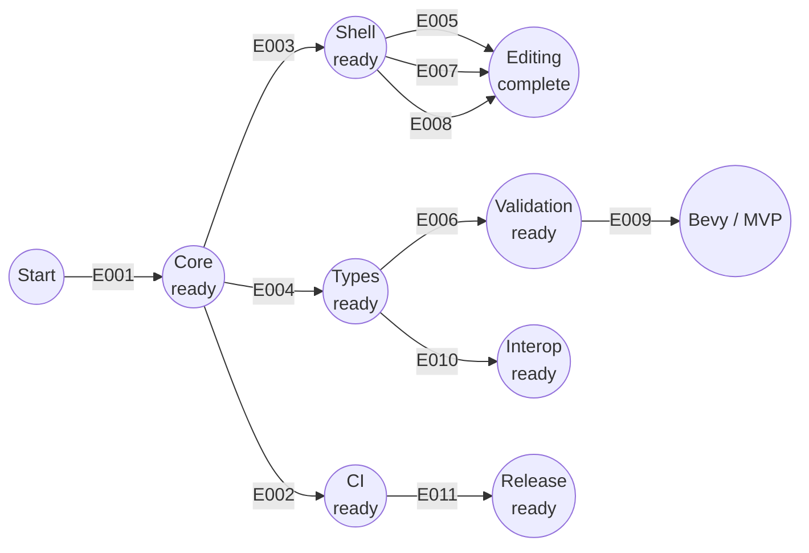

# Project Implementation Plan

**Product**: RONin | **Created**: 2026-06-11 | **Status**: Draft
**Total Epics**: 11 (P1: 9 · P2: 2) | **Categories**: Product 6 · Technical 3 · Operational 2 | **Waves**: 4

## Epic Checklist

### Wave 1 — Foundation

> The lossless core that every other epic builds on. Establishes the workspace and the byte-lossless concrete syntax tree.

- [ ] E001 [P1] [TECHNICAL] {PRD:CAP-001}{SAD:ADR-0001}{SAD:ADR-0002} Lossless CST core engine — workspace + byte-lossless parse/print, error-tolerant CST

### Wave 2 — Surfaces and type backbone

> The editor host, the quality gates, and the type-information backbone. All three depend only on the core and target distinct areas, so they run in parallel.

- [ ] E002 [P1] [OPERATIONAL] [P] {DOD:DDR-005} CI quality gates — fmt/clippy/test matrix + wasm32 core gate
- [ ] E003 [P1] [PRODUCT] [P] {PRD:CAP-006}{SAD:ADR-0003}{DOD:DDR-006} Desktop editor shell — egui app load/render/edit + logging
- [ ] E004 [P1] [TECHNICAL] [P] {PRD:CAP-002}{SAD:ADR-0004} Type acquisition and model — sources to normalized type model

### Wave 3 — Core editing

> The user-facing editing capabilities plus persistence safety and the release backbone. Most of these mutate the editor and core, so they are sequenced rather than parallelized; the release epic is independent.

- [ ] E005 [P1] [PRODUCT] {PRD:CAP-003} Smart authoring — format, snippets, structural autocomplete
- [ ] E006 [P1] [PRODUCT] {PRD:CAP-002}{SAD:ADR-0004} Type-aware validation — in-editor diagnostics, structural fallback
- [ ] E007 [P1] [TECHNICAL] {SAD:ADR-0005} Non-destructive persistence — atomic save, recovery, undo/redo
- [ ] E008 [P1] [PRODUCT] {PRD:CAP-004}{SAD:ADR-0003} Structural and table editing — tree/form + spreadsheet view
- [ ] E010 [P2] [PRODUCT] {PRD:CAP-007} Round-trip and interop — RON/JSON lossy-explicit, derive/sync
- [ ] E011 [P2] [OPERATIONAL] [P] {DOD:DDR-001,DDR-002,DDR-003,DDR-004} Release and distribution — dist + release-plz, provenance, channels

### Wave 4 — Bevy

> The co-equal Bevy mode, which extends the type model and validation with the Bevy type registry.

- [ ] E009 [P1] [PRODUCT] {PRD:CAP-005}{SAD:ADR-0004} Bevy mode — registry-aware validation, defaults elision

## Dependency Diagram

Activity-on-arrow: nodes are milestones, arrows are epics. Secondary dependencies (where an epic needs more than its primary predecessor) are listed under Epic Details → Depends on.

## Execution Wave Summary

| Wave | Epics | All Parallel? | Notes |
|------|-------|---------------|-------|
| 1 | E001 | n/a | Single foundation epic |
| 2 | E002, E003, E004 | Yes | Distinct areas (CI / ronin-app / ron-types); safe to parallelize |
| 3 | E005, E006, E007, E008, E010, E011 | No | E005–E008 and E010 share `ronin-app`/`ron-core`; sequence them. E011 is parallel-safe (repo/release config) |
| 4 | E009 | n/a | Needs validation (E006) and the type model (E004) |

## Parallel Execution Guidance

### Independent Epics
- **Wave 2**: E002 (CI config), E003 (egui app), E004 (ron-types) are fully independent — run concurrently.
- **Wave 3**: E011 (release/distribution config) is independent of the editing epics and can proceed alongside them.

### Integration Risks
- E005, E006, and E008 each add panels/handlers to the editor (E003) — agree on UI module boundaries early to avoid conflicts in app entry/state.
- E007 changes the document/save model that E005 and E008 edit against — land the persistence document model and undo stack early in Wave 3.
- E006 and E009 both extend the validation/type path — E009 should build on E006's diagnostics surface, not fork it.

### Shared Resource Conflicts
- `ronin-app` (from E003) is mutated by E005, E006, E007, E008 (and E009, E010 partially) — stabilize the editor document model before parallelizing.
- `ron-core` public API is extended by E007 (undo) and E010 (interop) — freeze the core API surface from E001 before dependents pile on.
- `TypeModel` (from E004) is extended by E009 (Bevy source) — keep the type-source adapter contract open for extension.

## Epic Details

### E001 — Lossless CST core engine
- **Category**: TECHNICAL | **Priority**: P1 | **Source**: {PRD:CAP-001}{SAD:ADR-0001}{SAD:ADR-0002}
- **Scope**: Establish the Cargo workspace (ron-core, ron-types, ronin-app) and implement the lossless concrete syntax tree that is the single source of truth for all editing. The core parses RON into a CST that retains comments, whitespace, ordering, and struct names, prints it back byte-for-byte, and stays WASM-clean.
- **Actors**: Core engine consumers (every other crate)
- **Key entities**: `Cst`, `SyntaxNode`, `Diagnostic`
- **Depends on**: — (foundation)
- **Dependency contracts**: none
- **Depended on by**: E002, E003, E004, E005, E006, E007, E008, E010
- **Produces (shared)**: `ron-core` crate; lossless parse/print/transform API; the workspace skeleton
- **Constraints**: `ron-core` must compile to `wasm32` with no filesystem, UI, or async-runtime dependencies; parsing must be error-tolerant; all source under `/src`
- **Acceptance criteria**:
  - [ ] Workspace with ron-core, ron-types, ronin-app crates; ron-core builds for native and wasm32 with no fs/UI/async deps
  - [ ] Parser produces a lossless CST retaining comments, whitespace, ordering, and struct names
  - [ ] Parse→print round-trips representative RON byte-for-byte (property + snapshot tests on a corpus)
  - [ ] Invalid/in-progress input yields an error-tolerant CST plus diagnostics, never a panic
- **Specify input**:
  - **Description**: Build the lossless RON CST and workspace that everything else consumes.
  - **Actors**: Downstream crates
  - **Key entities**: `Cst`, `SyntaxNode`, `Diagnostic`
  - **Depends on artifacts**: specs/sad.md, specs/adrs/0001-lossless-cst-editing-model.md, specs/adrs/0002-hexagonal-cargo-workspace.md
  - **Constraints**: WASM-clean core; error-tolerant; byte-lossless round-trip
- **Pipeline hints**: skip_clarify

### E002 — CI quality gates
- **Category**: OPERATIONAL | **Priority**: P1 | **Source**: {DOD:DDR-005}
- **Scope**: Stand up the GitHub Actions pipeline that validates every change: format, lint, and test across all three OSes, plus a dedicated wasm32 build of ron-core that enforces the WASM-clean invariant. Add dependency scanning and build caching.
- **Actors**: Maintainer, contributors
- **Key entities**: CI workflow, cache key, audit policy
- **Depends on**: E001 (workspace + crates to build/test)
- **Dependency contracts**: needs the buildable workspace from E001
- **Depended on by**: E011 (release builds on green CI)
- **Produces (shared)**: reusable CI workflow; wasm32 gate; audit/deny config
- **Constraints**: zero-budget (GitHub free tier); stable toolchain; `Cargo.lock` committed
- **Acceptance criteria**:
  - [ ] CI runs fmt check, clippy -D warnings, and tests across Windows/macOS/Linux
  - [ ] A dedicated job builds ron-core for wasm32-unknown-unknown; failure blocks merge
  - [ ] cargo-audit + cargo-deny run in CI and on a schedule
  - [ ] Build caching (rust-cache) configured; Cargo.lock committed
- **Specify input**:
  - **Description**: Establish CI quality gates including the mandatory wasm32 core gate.
  - **Actors**: Maintainer, contributors
  - **Key entities**: CI workflow, cache, audit policy
  - **Depends on artifacts**: specs/dod.md (DDR-005), specs/adrs/0002-hexagonal-cargo-workspace.md
  - **Constraints**: free runners; stable toolchain
- **Pipeline hints**: skip_clarify, skip_checklist

### E003 — Desktop editor shell
- **Category**: PRODUCT | **Priority**: P1 | **Source**: {PRD:CAP-006}{SAD:ADR-0003}{DOD:DDR-006}
- **Scope**: Build the egui/eframe desktop application that hosts the core: open and render a RON file, edit it with live reparsing, and provide the extension points (diagnostics, tree/table, mode selection) that later editing epics plug into. Establish the local-only tracing logging baseline.
- **Actors**: Rust developer, Bevy developer
- **Key entities**: `EditorDocument`, app/UI host, log sink
- **Depends on**: E001 (CST parse/print API)
- **Dependency contracts**: imports the parse/print API and `Cst` from E001
- **Depended on by**: E005, E006, E007, E008, E009, E010, E011
- **Produces (shared)**: `ronin-app` crate; `EditorDocument`; UI extension points; logging baseline
- **Constraints**: no network/telemetry; heavy work off the per-frame update path; logs/settings in OS-appropriate directories
- **Acceptance criteria**:
  - [ ] User can open a RON file; it loads into the CST and renders in the window
  - [ ] User can edit; the document reparses and reflects changes live
  - [ ] Local tracing logging writes to the OS-appropriate directory; no network calls
  - [ ] Layout exposes extension points for diagnostics, tree/table, and mode selection
- **Specify input**:
  - **Description**: Build the egui editor shell that hosts the core and later capabilities.
  - **Actors**: Rust developer, Bevy developer
  - **Key entities**: `EditorDocument`, UI host
  - **Depends on artifacts**: specs/adrs/0003-egui-gui-framework.md, specs/dod.md (DDR-006)
  - **Constraints**: local-first; no telemetry; responsive frame loop
- **Pipeline hints**: —

### E004 — Type acquisition and model
- **Category**: TECHNICAL | **Priority**: P1 | **Source**: {PRD:CAP-002}{SAD:ADR-0004}
- **Scope**: Build the ron-types crate that learns the types behind a RON file and normalizes them into one internal model. It extracts type info from Rust source (syn), schemars-derived schemas, and user-supplied schemas, reconciling serde attributes and RON-only constructs into a single `TypeModel` the validator consumes.
- **Actors**: Validation, interop, Bevy mode
- **Key entities**: `TypeModel`, `TypeSource`
- **Depends on**: E001 (workspace skeleton)
- **Dependency contracts**: lives in the workspace from E001; feeds, but does not depend on, the CST
- **Depended on by**: E006, E009, E010
- **Produces (shared)**: `ron-types` crate; `TypeModel`; type-source adapter contract
- **Constraints**: native-gated (kept out of the WASM-clean core); the WASM core consumes a serialized schema; unresolved types represented as unknown, not error
- **Acceptance criteria**:
  - [ ] Static Rust analysis (syn) extracts struct/enum/field types honoring serde attributes
  - [ ] schemars-derived and user-supplied JSON schemas load as type sources
  - [ ] All sources normalize into one `TypeModel`
  - [ ] RON-only constructs (tuples, char, non-string keys, extensions) are represented via the type-model extension layer
- **Specify input**:
  - **Description**: Acquire and normalize type information from multiple sources into one model.
  - **Actors**: Validation, interop, Bevy mode
  - **Key entities**: `TypeModel`, `TypeSource`
  - **Depends on artifacts**: specs/adrs/0004-schema-optional-type-model.md
  - **Constraints**: native-gated; serialized schema crosses to WASM core
- **Pipeline hints**: lightweight

### E005 — Smart authoring
- **Category**: PRODUCT | **Priority**: P1 | **Source**: {PRD:CAP-003}
- **Scope**: Deliver the everyday authoring experience on top of the editor: a deterministic formatter that preserves comments and intent, structural autocomplete driven by CST context, and snippets for common RON constructs. All actions are non-destructive.
- **Actors**: Rust developer, Bevy developer
- **Key entities**: formatter, completion provider, snippet set
- **Depends on**: E003 (editor host), E001 (CST + format API)
- **Dependency contracts**: hosts UI in `ronin-app` (E003); calls format/transform on `Cst` (E001)
- **Depended on by**: —
- **Produces (shared)**: formatting and completion services
- **Constraints**: authoring must never corrupt the document; formatting deterministic
- **Acceptance criteria**:
  - [ ] Deterministic formatter pretty-prints RON preserving comments and intent
  - [ ] Structural autocomplete suggests fields/variants/keys from CST context
  - [ ] Snippets insert common RON constructs
  - [ ] Authoring actions round-trip without corruption
- **Specify input**:
  - **Description**: Add formatting, snippets, and structural autocomplete to the editor.
  - **Actors**: Rust developer, Bevy developer
  - **Key entities**: formatter, completion provider
  - **Depends on artifacts**: specs/prd.md (CAP-003)
  - **Constraints**: non-destructive; deterministic formatting
- **Pipeline hints**: —

### E006 — Type-aware validation
- **Category**: PRODUCT | **Priority**: P1 | **Source**: {PRD:CAP-002}{SAD:ADR-0004}
- **Scope**: Surface errors before runtime. With a `TypeModel` available, validate the CST against types and report precise inline diagnostics; with no type info, fall back to structural-only validation. Unresolved types are marked unknown rather than flagged as errors.
- **Actors**: Rust developer, Bevy developer
- **Key entities**: validator, `Diagnostic`, source ranges
- **Depends on**: E001 (CST), E004 (`TypeModel`), E003 (diagnostics UI)
- **Dependency contracts**: reads `Cst` (E001), consumes `TypeModel` (E004), renders via the editor's diagnostics extension point (E003)
- **Depended on by**: E009
- **Produces (shared)**: validation/diagnostics API
- **Constraints**: graceful degradation without types; precise source mapping; no false positives on unknowns
- **Acceptance criteria**:
  - [ ] With a `TypeModel`, type/structural errors surface inline
  - [ ] Without type info, structural-only validation still runs
  - [ ] Diagnostics map to precise CST source ranges
  - [ ] Unresolved types are marked unknown, not reported as errors
- **Specify input**:
  - **Description**: In-editor type-aware validation with structural fallback.
  - **Actors**: Rust developer, Bevy developer
  - **Key entities**: validator, `Diagnostic`
  - **Depends on artifacts**: specs/adrs/0004-schema-optional-type-model.md
  - **Constraints**: progressive; precise ranges; safe unknowns
- **Pipeline hints**: —

### E007 — Non-destructive persistence
- **Category**: TECHNICAL | **Priority**: P1 | **Source**: {SAD:ADR-0005}
- **Scope**: Guarantee that the editor never loses or corrupts a file. Implement atomic save (temp-write + fsync + rename), periodic autosave to a sidecar recovery file, crash-recovery detection on reopen, and CST-backed undo/redo.
- **Actors**: Rust developer, Bevy developer
- **Key entities**: `save_atomic`, `UndoStack`, recovery sidecar
- **Depends on**: E001 (CST for undo), E003 (editor save flow)
- **Dependency contracts**: extends `ron-core` with undo over `Cst` (E001); wires save/recovery into `EditorDocument` (E003)
- **Depended on by**: E005, E008 (edit against the document/undo model)
- **Produces (shared)**: persistence/save API; `UndoStack`
- **Constraints**: original file untouched until commit; autosave never overwrites the user file; same-filesystem temp file
- **Acceptance criteria**:
  - [ ] Saving uses atomic temp-write + fsync + rename; original intact on failure
  - [ ] Periodic autosave writes a sidecar recovery file without overwriting the user file
  - [ ] On reopen after a crash, recovery is detected and restore offered
  - [ ] Undo/redo operates over the CST and is bounded and reliable
- **Specify input**:
  - **Description**: Atomic save, autosave/recovery, and CST-backed undo.
  - **Actors**: Rust developer, Bevy developer
  - **Key entities**: `save_atomic`, `UndoStack`
  - **Depends on artifacts**: specs/adrs/0005-non-destructive-persistence.md
  - **Constraints**: never corrupt; recoverable
- **Pipeline hints**: skip_clarify

### E008 — Structural and table editing
- **Category**: PRODUCT | **Priority**: P1 | **Source**: {PRD:CAP-004}{SAD:ADR-0003}
- **Scope**: Make structure editable, not just text. Provide tree/form navigation over nested RON and a virtualized spreadsheet view for uniform sections (lists of same-type records), with a clear boundary where non-uniform/variant data falls back to tree/form. All structural edits round-trip losslessly.
- **Actors**: Rust developer, Bevy developer, data wrangler
- **Key entities**: tree/form model, table model, virtualized rows
- **Depends on**: E001 (CST transforms), E003 (editor host)
- **Dependency contracts**: mutates `Cst` via transforms (E001); hosts views in `ronin-app` (E003)
- **Depended on by**: —
- **Produces (shared)**: structural/table editing views
- **Constraints**: table view limited to uniform sections; virtualization for large data; lossless edits
- **Acceptance criteria**:
  - [ ] Tree/form view navigates and edits nested RON structures
  - [ ] Uniform sections render as an editable virtualized table
  - [ ] Non-uniform/variant data falls back to tree/form with a clear boundary
  - [ ] Structural edits round-trip losslessly through the CST
- **Specify input**:
  - **Description**: Tree/form plus spreadsheet-style editing for uniform sections.
  - **Actors**: Rust developer, Bevy developer, data wrangler
  - **Key entities**: tree/form model, table model
  - **Depends on artifacts**: specs/prd.md (CAP-004), specs/adrs/0003-egui-gui-framework.md
  - **Constraints**: uniform-only tables; virtualized; lossless
- **Pipeline hints**: —

### E009 — Bevy mode
- **Category**: PRODUCT | **Priority**: P1 | **Source**: {PRD:CAP-005}{SAD:ADR-0004}
- **Scope**: Deliver the co-equal Bevy mode. Load the Bevy type registry/reflection as a type source into the `TypeModel`, run scene-aware validation against it, and offer defaults elision / verbosity reduction for `.scn.ron`. A mode switch toggles serde vs Bevy behavior.
- **Actors**: Bevy developer
- **Key entities**: Bevy `TypeSource`, scene model, mode switch
- **Depends on**: E006 (validation), E004 (`TypeModel`), E003 (mode UI)
- **Dependency contracts**: adds a Bevy `TypeSource` to `TypeModel` (E004); reuses the validation/diagnostics surface (E006); adds mode selection in the editor (E003)
- **Depended on by**: —
- **Produces (shared)**: Bevy type source; scene-mode behaviors
- **Constraints**: consume Bevy registry as data (BRP/export), do not embed Bevy; version-tolerant
- **Acceptance criteria**:
  - [ ] Bevy type registry/reflection loads as a type source into the `TypeModel`
  - [ ] Scene-aware validation flags type-registry mismatches in `.scn.ron`
  - [ ] Defaults elision / verbosity reduction available for Bevy scenes
  - [ ] Mode selection switches between serde and Bevy behavior
- **Specify input**:
  - **Description**: Bevy-registry-aware validation and scene affordances as a distinct mode.
  - **Actors**: Bevy developer
  - **Key entities**: Bevy `TypeSource`, mode switch
  - **Depends on artifacts**: specs/adrs/0004-schema-optional-type-model.md, specs/prd.md (CAP-005)
  - **Constraints**: registry-as-data; no Bevy embed
- **Pipeline hints**: —

### E010 — Round-trip and interop
- **Category**: PRODUCT | **Priority**: P2 | **Source**: {PRD:CAP-007}
- **Scope**: Move data between RON and JSON and stay in sync with Rust types, with all losses made explicit. Convert RON⇄JSON with documented handling of constructs JSON cannot represent, derive an initial RON document from Rust types via the `TypeModel`, and warn on lossy operations.
- **Actors**: Rust developer
- **Key entities**: converter, lossy-construct map
- **Depends on**: E001 (CST), E004 (`TypeModel`)
- **Dependency contracts**: reads/writes `Cst` (E001); uses `TypeModel` for derive/sync (E004)
- **Depended on by**: —
- **Produces (shared)**: interop/conversion API
- **Constraints**: RON⇄JSON is lossy by design; never silently drop data; serde `ron` only at the interop boundary
- **Acceptance criteria**:
  - [ ] Convert RON→JSON and JSON→RON with explicit handling of lossy constructs
  - [ ] Derive an initial RON document from Rust types via the `TypeModel`
  - [ ] Lossy conversions warn the user and never silently drop data
  - [ ] The round-trip-safe subset is documented
- **Specify input**:
  - **Description**: Explicit, lossy-aware RON⇄JSON conversion and derive-from-types.
  - **Actors**: Rust developer
  - **Key entities**: converter
  - **Depends on artifacts**: specs/prd.md (CAP-007), specs/adrs/0001-lossless-cst-editing-model.md
  - **Constraints**: lossy-explicit; no silent loss
- **Pipeline hints**: —

### E011 — Release and distribution
- **Category**: OPERATIONAL | **Priority**: P2 | **Source**: {DOD:DDR-001,DDR-002,DDR-003,DDR-004}
- **Scope**: Stand up the phased release backbone. Use dist to build cross-platform binaries to GitHub Releases (checksums + install scripts) and release-plz to automate version bumps, changelogs, and ordered crates.io publishing. Attach keyless build-provenance attestations and drive stable vs prerelease channels by tag suffix. (Code signing deferred per DDR-003.)
- **Actors**: Maintainer, end-users
- **Key entities**: release workflow, manifest, attestation
- **Depends on**: E003 (a buildable app to release), E002 (green CI)
- **Dependency contracts**: packages the `ronin-app` binary (E003); triggers after CI passes (E002)
- **Depended on by**: —
- **Produces (shared)**: release/distribution pipeline
- **Constraints**: zero-budget; unsigned binaries (checksums + provenance only); GitHub-first phased ladder
- **Acceptance criteria**:
  - [ ] dist builds cross-platform binaries to GitHub Releases with checksums and install scripts
  - [ ] release-plz automates version bumps, changelog, and ordered crates.io publishing
  - [ ] Releases carry keyless build-provenance attestations
  - [ ] Stable vs prerelease channels driven by tag suffix
- **Specify input**:
  - **Description**: Phased GitHub-first release automation with provenance and channels.
  - **Actors**: Maintainer, end-users
  - **Key entities**: release workflow, attestation
  - **Depends on artifacts**: specs/dod.md (DDR-001–004)
  - **Constraints**: no paid signing; checksums + provenance
- **Pipeline hints**: skip_clarify, skip_checklist

## Coverage Validation

### PRD Capabilities → Epics

| Capability | Epic(s) |
|------------|---------|
| CAP-001 RON Intelligence Core Engine | E001 |
| CAP-002 Type-Aware Validation | E004, E006 |
| CAP-003 Smart Authoring | E005 |
| CAP-004 Structural & Table Editing | E008 |
| CAP-005 Bevy Mode | E009 |
| CAP-006 Reference Desktop Editor | E003 |
| CAP-007 Round-Trip & Interop | E010 |

### SAD ADRs → Epics

| ADR | Epic(s) |
|-----|---------|
| ADR-0001 Lossless CST editing model | E001 |
| ADR-0002 Hexagonal workspace, WASM-clean core | E001 |
| ADR-0003 egui/eframe GUI | E003, E008 |
| ADR-0004 Schema-optional type model | E004, E006, E009 |
| ADR-0005 Non-destructive persistence | E007 |

### DOD DDRs → Epics

| DDR | Epic(s) |
|-----|---------|
| DDR-001 Phased distribution ladder | E011 |
| DDR-002 Release automation (dist + release-plz) | E011 |
| DDR-003 Defer signing; checksums + provenance | E011 |
| DDR-004 Stable + prerelease channels | E011 |
| DDR-005 Mandatory wasm32 build gate | E002 |
| DDR-006 Local-only, opt-in observability | E003 |

### Uncovered Items

None. Every PRD capability, accepted ADR, and DDR maps to at least one epic.

## Shared Artifact Surface

### Shared Data Entities

| Entity | Introduced by | Consumed by |
|--------|---------------|-------------|
| `Cst` / `SyntaxNode` | E001 | E003, E005, E006, E007, E008, E010 |
| `Diagnostic` | E001 / E006 | E003, E006, E009 |
| `TypeModel` | E004 | E006, E009, E010 |
| `EditorDocument` | E003 | E005, E006, E007, E008 |
| `UndoStack` | E007 | E005, E008 |

### API Surfaces

| Surface | Introduced by | Consumed by |
|---------|---------------|-------------|
| ron-core public API (parse/print/transform) | E001 | E003, E005, E007, E008, E010 |
| validation/diagnostics API | E006 | E003, E009 |
| type-acquisition API | E004 | E006, E009, E010 |
| persistence/save API | E007 | E003 |

### Libraries / Modules

| Module | Introduced by | Consumed by |
|--------|---------------|-------------|
| `ron-core` crate | E001 | all crates |
| `ron-types` crate | E004 | E006, E009, E010 |
| `ronin-app` crate | E003 | E005, E006, E007, E008, E009, E010 |

## Wave Transition Protocol

Before starting Wave N+1, verify:
- All Wave N epics have passed their quality gate (CI green, including the wasm32 core build).
- The technical context is updated if any epic changed shared APIs or the type model.
- Shared artifacts promised by Wave N (`Cst` API, `EditorDocument`, `TypeModel`, persistence API) are produced and stable.
- Dependency contracts for Wave N+1 epics are satisfiable against the produced artifacts.
- The `ron-core` public API and the editor document model are frozen before parallelizing dependents.
