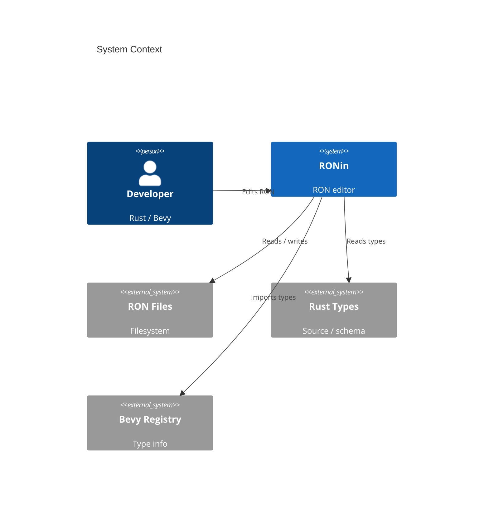
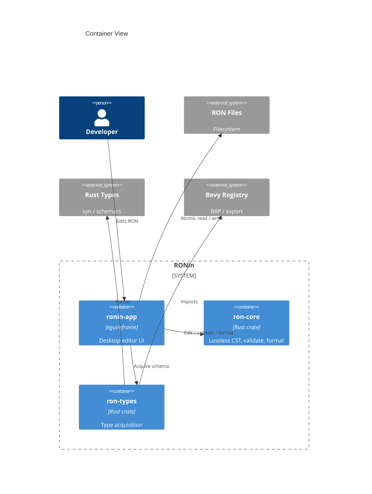
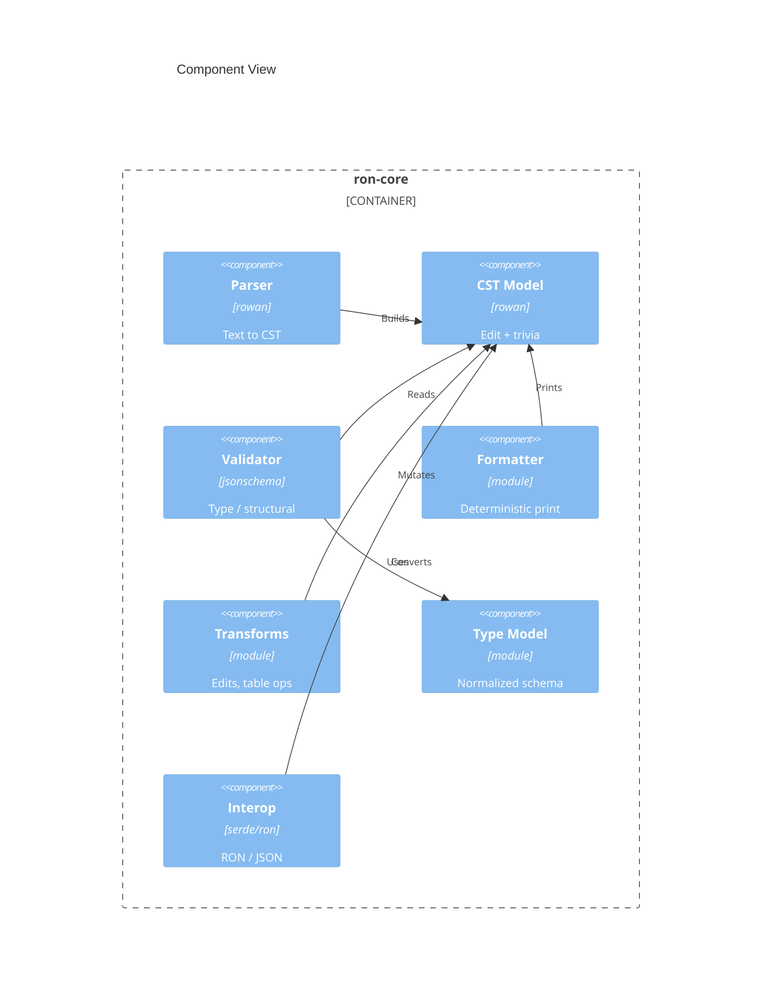
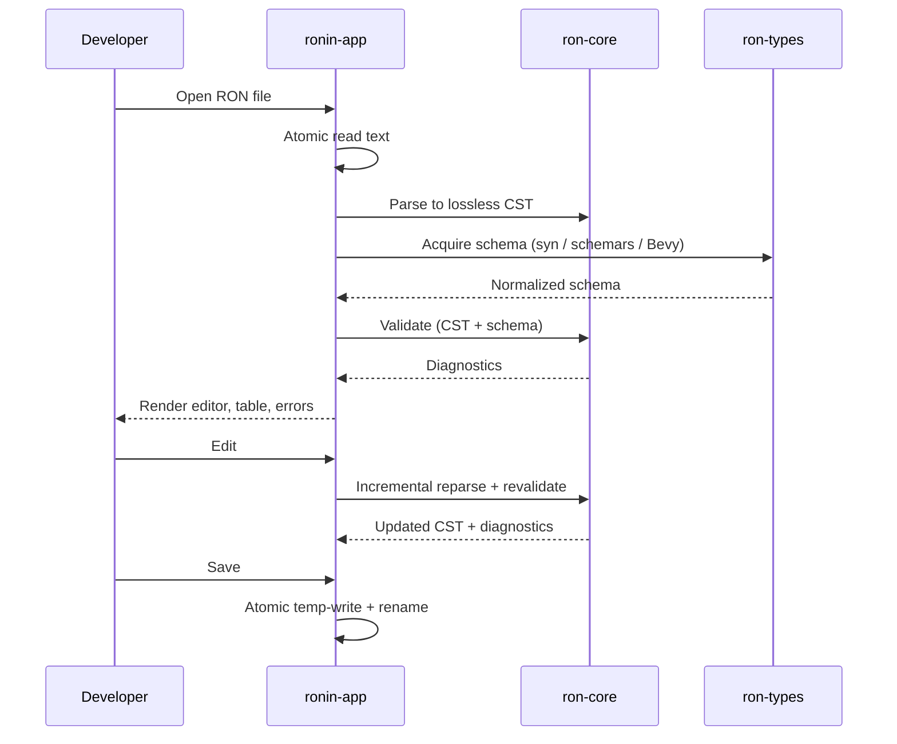
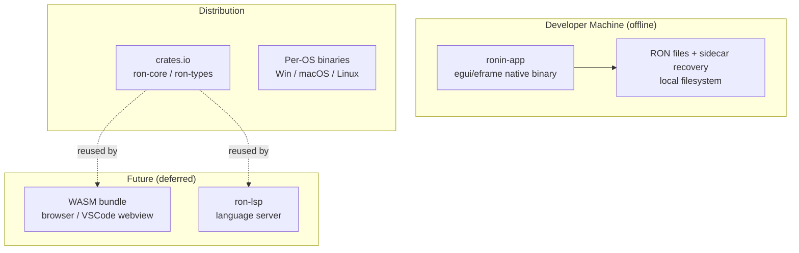

# Software Architecture Document: RONin

> Date: 2026-06-10 | Status: Draft

## Purpose and Scope

RONin is an intelligent editor for RON (Rusty Object Notation). Its architecture is organized around a single reusable Rust "RON intelligence" core that parses, validates, formats, and transforms RON, plus an egui desktop reference editor built on that core. The core is deliberately portable so that future frontends — a language server and a browser/VSCode-webview UI (WASM) — reuse it without modification. The system is a local-first, offline desktop tool with filesystem-only storage. It serves general serde-RON Rust developers and Bevy game developers through co-equal serde and Bevy modes. The defining architectural concern is non-destructive editing: RONin must never reflow or corrupt a file, and must preserve comments, formatting, ordering, and struct names through every edit.

## Technical Context

**Language/Version**: Rust (2021 edition, stable toolchain)  
**Primary Dependencies**: rowan (lossless CST; cstree acceptable alternative), egui/eframe + egui_extras (GUI and virtualized tables), syn (static Rust type extraction), schemars + jsonschema (schema derivation and validation), serde + the `ron` crate (interop/JSON only, never the editing model), tracing (local logging) 
**Storage**: Local filesystem — user RON files (source of truth), sidecar autosave/recovery files, and app settings in the OS config directory. No database, no server.  
**Testing**: cargo test (unit + integration); snapshot tests (insta) for lossless round-trip/formatting; property tests (proptest) for parser/round-trip invariants; corpus tests against real serde and Bevy RON 
**Target Platform**: Cross-platform desktop native binaries (Windows, macOS, Linux); future WASM target (browser / VSCode webview) for core + UI  
**Project Type**: Cargo workspace — reusable library (core) + desktop application; future LSP server 
**Performance Goals**: Interactive editing within the ~16 ms frame budget; incremental reparse of the edited region; virtualized table rendering for 100k+ rows; validation off the UI frame path  
**Constraints**: Rust-only; `ron-core` must be WASM-clean (no filesystem/UI/async-runtime deps); offline/local-first with no telemetry by default; never reflow/corrupt files; RON has no native schema (type info is external); RON⇄JSON is lossy by design  
**Scale/Scope**: Single-user desktop tool; the scaling axis is large individual files (multi-MB Bevy scenes, large uniform datasets), not user count; solo/OSS delivery

## System Scope and Context

RONin sits between a developer and their RON files on the local filesystem. To provide type-aware intelligence it reads type information from external sources — the user's Rust type definitions (parsed statically), schemas (schemars-derived or user-supplied), and the Bevy type registry — but it never executes user code or makes network calls. Future LSP/WASM frontends are out of MVP scope but are first-class consumers of the same core API.

### C4 System Context

### C4 Container View

The application crate is the adapter that owns all I/O: it reads/writes files and orchestrates type acquisition, then feeds text and serialized schema into the I/O-free `ron-core`. This keeps the core WASM-clean and reusable. A future `ron-lsp` crate (deferred) is another adapter over the same core API.

### C4 Component View

The Type Model is populated externally (the app wires the normalized schema from `ron-types` into the core), so the core carries no native type-acquisition dependencies.

## Solution Strategy and Architecture Style

- **Architecture Style**: Modular Cargo workspace following hexagonal / ports-and-adapters. A portable, I/O-free `ron-core` exposes one public API contract; `ronin-app` (egui) and future `ron-lsp`/WASM bundles are adapters. Type acquisition is isolated in a native-gated `ron-types` crate so the WASM core stays lean.
- **Source Code Location**: All project source code resides under the `/src` directory; workspace crates are rooted there (e.g. `/src/ron-core`, `/src/ron-types`, `/src/ronin-app`).
- **Why this style fits**: The PRD mandates one core reused across the desktop editor now and LSP/VSCode later. A WASM-clean core with thin adapters (the Crux/Prisma pattern) delivers that reuse and isolates platform concerns. A lossless CST core (rust-analyzer's model) is the only representation that satisfies the never-corrupt requirement.
- **Alternatives considered**: A monolithic single crate (rejected — UI/IO/native deps would block WASM reuse); the serde `ron` crate as the editing model (rejected — not lossless; see {SAD:ADR-0001}); Tauri/Iced/Slint for the GUI (rejected in favor of egui's single-language native+WASM reuse; see {SAD:ADR-0003}).

## Key Runtime Flows and Failure Paths

### Primary Flow

### Failure Paths

- Invalid / in-progress RON -> error-tolerant parser still produces a CST; partial diagnostics shown; no crash.
- Schema source unavailable (no Rust types / no Bevy registry) -> fall back to structural-only validation; type-aware features degrade gracefully.
- Save failure (disk full / permission denied) -> atomic rename never commits, so the original file is untouched; error surfaced; recovery sidecar retained.
- Crash / power loss -> on reopen, a sidecar recovery file is detected and restore is offered.
- Partially resolvable Rust types (macros / generics / cfg) -> validate what resolves; mark unknowns instead of emitting false-positive errors.

## Deployment and Infrastructure View

## Cross-Cutting Concerns

### Security

Local-first with no network calls or telemetry by default. The trust boundary is the local filesystem plus user-provided Rust source and schemas. Rust source is parsed statically (syn) and never executed; macros are not expanded against untrusted code. Bevy type info is consumed as data (JSON), not executed. No secrets or credentials are handled.

### Reliability

Atomic save (temp-write + fsync + rename over target), sidecar autosave/recovery that never overwrites the user file, error-tolerant parsing, graceful degradation when schema sources are missing, and CST-backed undo/redo. See {SAD:ADR-0005}.

### Observability

A lightweight `tracing` baseline writes to a rotating local log file; verbose diagnostics are opt-in. No remote telemetry or crash reporting by default.

### Data Management

The user's RON files are the source of truth; RONin preserves comments, formatting, and ordering on every write. RON⇄JSON interop is explicit and lossy by design (JSON cannot represent enum variant identity, tuples-vs-lists, struct names, chars, unit types, or non-string keys). App settings live in the OS config directory; no user data leaves the machine.

### Integration Strategy

`ron-types` integrates external type information: static Rust source via syn, schemars-derived or user-supplied JSON Schema, and the Bevy type registry (BRP endpoint or registry-export file). All sources are normalized into one internal JSON-Schema-shaped type model the validator consumes ({SAD:ADR-0004}). The stable `ron-core` public API is the integration contract for future LSP/WASM frontends. RON⇄JSON conversion uses the serde `ron` crate only at the interop boundary.

### Operations

Solo/OSS ownership. Crates are semver-versioned and published to crates.io; the desktop app ships as per-OS release binaries. CI runs `cargo test`, `clippy`, and `fmt`. There are no servers to operate.

## Quality Attributes

| Attribute | Target | Measurement | Notes |
|-----------|--------|-------------|-------|
| Performance | Edits interactive within ~16 ms frame; 100k+ table rows scroll smoothly | Frame-time profiling; large-corpus benchmarks | Virtualized rows; validation off UI thread |
| Reliability | Zero file corruption; unsaved work recoverable after crash | Fault injection (disk full, kill mid-save); recovery tests | Atomic save + sidecar ({SAD:ADR-0005}) |
| Correctness | Byte-lossless round-trip (parse→print preserves comments/format/order) | Property + snapshot tests on corpus | Lossless CST ({SAD:ADR-0001}) |
| Security | No network/telemetry by default; no execution of user code | Egress audit; static-analysis-only review | Local-first; syn parses, never executes |
| Maintainability | Core reusable unchanged across native / WASM / LSP | Core compiles to wasm32 with no fs/UI deps; API stability | Hexagonal workspace ({SAD:ADR-0002}) |
| Scalability | Multi-MB scenes / large uniform datasets stay interactive | Large-file load/edit benchmarks | Incremental reparse + virtualization |

## Architecture Decision Records

Project-level architectural decisions are maintained as standalone MADR files under `specs/adrs/`. This table is a navigational index — full decision records live in the linked files.

| ADR ID | Title | Status | Date | Supersedes | File |
|--------|-------|--------|------|------------|------|
| ADR-0001 | Custom Lossless CST as the Editing Model | accepted | 2026-06-10 | — | [0001-lossless-cst-editing-model.md](adrs/0001-lossless-cst-editing-model.md) |
| ADR-0002 | Hexagonal Cargo Workspace with a WASM-Clean Core | accepted | 2026-06-10 | — | [0002-hexagonal-cargo-workspace.md](adrs/0002-hexagonal-cargo-workspace.md) |
| ADR-0003 | egui/eframe as the GUI Framework | accepted | 2026-06-10 | — | [0003-egui-gui-framework.md](adrs/0003-egui-gui-framework.md) |
| ADR-0004 | Schema-Optional Progressive Type-Awareness via a Normalized Type Model | accepted | 2026-06-10 | — | [0004-schema-optional-type-model.md](adrs/0004-schema-optional-type-model.md) |
| ADR-0005 | Non-Destructive Persistence and Crash Safety | accepted | 2026-06-10 | — | [0005-non-destructive-persistence.md](adrs/0005-non-destructive-persistence.md) |

<!-- Rows are managed by the ADR Author subagent. Do not embed full decision prose here. -->

## Risks, Assumptions, Constraints, and Open Questions

### Risks

- Authoring a lossless RON parser/grammar is substantial effort and must track the RON spec and its extensions.
- Static Rust type extraction (syn) cannot fully resolve generics/macros/cfg; incomplete schemas risk false diagnostics unless unknowns are handled explicitly.
- Bevy type-registry integration is coupled to Bevy versions.
- RON-only constructs (tuples, char, non-string keys, extensions) do not map cleanly to JSON Schema; the type model needs a RON-aware extension layer.
- egui's canvas rendering imposes accessibility limits for the desktop app and any future webview embedding.
- Scope breadth (three P1 capability clusters plus two modes plus a GUI) is large for solo delivery.

### Assumptions

- rowan/cstree (grammar-agnostic) suits RON, as validated by the rust-analyzer precedent.
- Bevy type info is reachable via the BRP endpoint or a registry-export file without embedding Bevy as a dependency.
- Users who want type-aware features generally have access to the Rust types behind their RON.
- A same-filesystem temp file is available for atomic rename in normal usage.

### Constraints

- `ron-core` must be WASM-clean: no `std::fs`, no UI, no async runtime, no native-only dependencies.
- Type acquisition (syn/schemars/Bevy) is confined to the native `ron-types` crate; the WASM core consumes a serialized schema.
- All project source code resides under `/src`.
- Offline/local-first; no telemetry by default.
- Files must never be reflowed or corrupted.

### Open Questions

- Final selection between rowan and cstree (string interning / threading tradeoffs).
- Exact internal type-model representation for RON-only constructs beyond JSON Schema.
- Bevy type-info delivery for MVP: live BRP, exported file, or both.
- Desktop packaging/signing per OS and distribution channel (carried from the PRD).
- Whether a headless `ron-cli` crate (CI validate/format) enters MVP or the roadmap.
- The "uniform section" detection algorithm that gates table-view eligibility (from the PRD).

## Project Context Baseline Updates

- [Reserved for reusable project-level technical context promoted from downstream planning runs.]
